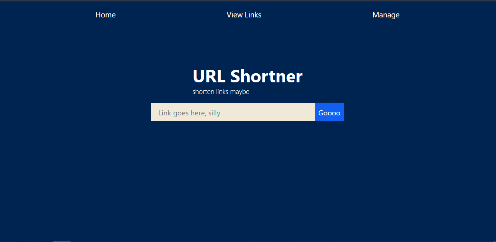

# url_shortner

URL shortner made with express & mongodb

## Getting started
### Start Mongodb server
```
mongod --port 27017 --dbpath <dbpath>
```
### Start node server

```
npm install 
npm start
```

